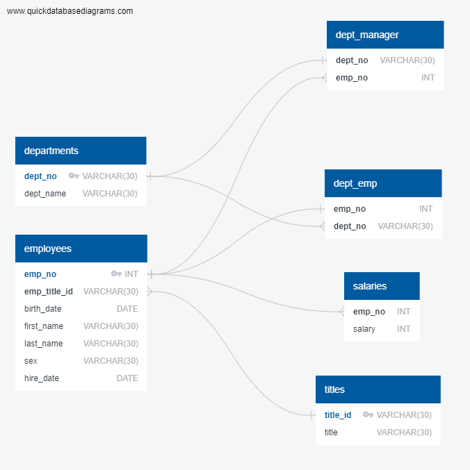

# sql-challenge

## The following repository is a demonstration of creating a database and six tables of employee information which I used various SQL queries to pull information on specific employee salaries and departments
## 1. I created a schema which created tables in my database for each csv file of data. Once the tables were established, I created an entity relationship diagram for reference.
[Database Setup Schema](employee_db_schema.sql)

## 2. Once the tables were created in my database, I imported the data into their corresponding tables and performed several queries to pull relevant information from the dataset:
[SQL Queries](employee_db_queries.sql)
